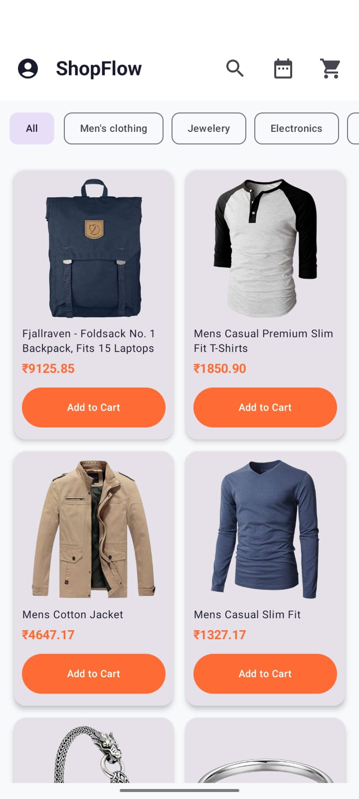
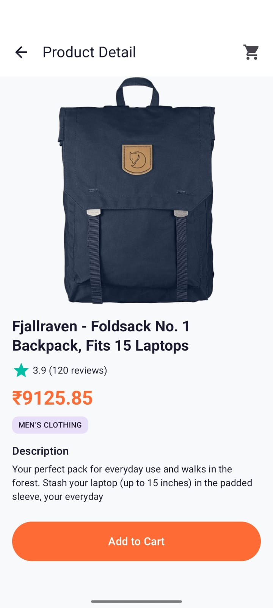
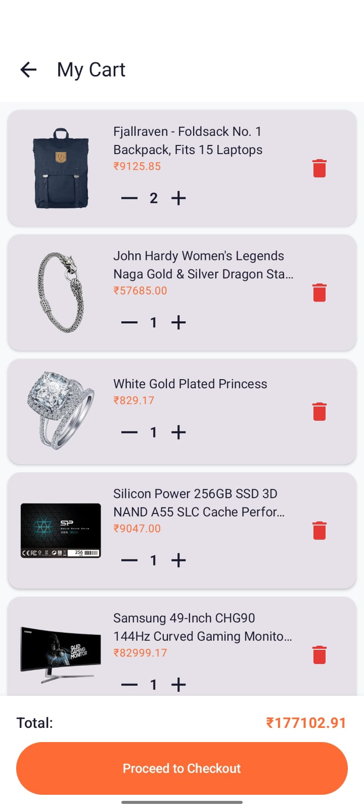
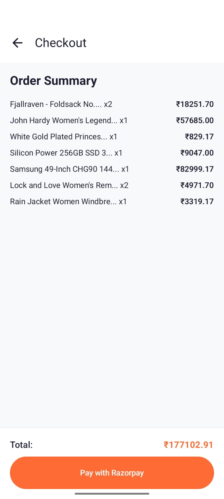
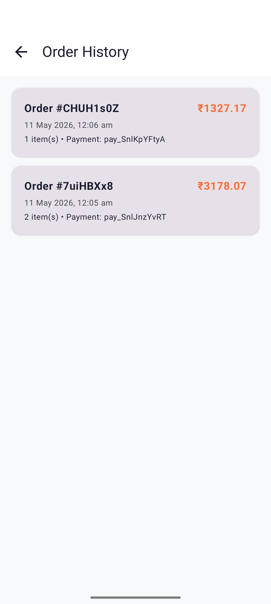
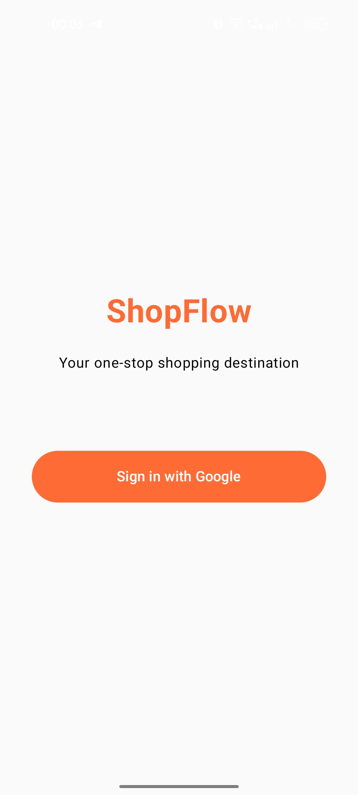

# 🛍️ ShopFlow - E-Commerce Android App

A full-featured e-commerce Android app built with modern Android development stack.

## 📱 Demo
[YouTube Demo](https://youtube.com/shorts/avfYfzgxgKs?feature=share)

## 📸 Screenshots
| Home                           | Product Detail | Cart |
|--------------------------------|---------------|------|
|  |  |  |

| Checkout | Orders | Login |
|----------|--------|-------|
|  |  |  |

## ✨ Features
- 🔐 Google Sign-In via Firebase Auth
- 🛒 Product listing with Search & Filter
- 📦 Cart with offline support (Room DB)
- 💳 Razorpay sandbox payment
- 📋 Order history (Firestore)
- 📡 Offline caching (OkHttp)
- 🎨 Custom Material3 theme

## 🏗️ Architecture
- MVVM + Clean Architecture
- UI → ViewModel → UseCase → Repository → DataSource

## 🛠️ Tech Stack
| Layer | Technology |
|-------|-----------|
| UI | Jetpack Compose |
| DI | Hilt |
| Network | Retrofit + OkHttp |
| Local DB | Room |
| Auth | Firebase Auth |
| Database | Firestore |
| Payments | Razorpay |
| Image | Coil |
| Navigation | Navigation Compose |

## 🚀 Setup Instructions

1. Clone the repository

```bash
git clone https://github.com/Leelasri211/ShopFlow.git
```

2. Add your `google-services.json` file inside the `app/` directory

3. Add your Firebase Web Client ID in `LoginScreen.kt`

4. Add your Razorpay Test Key in `RazorpayHelper.kt`

5. Sync Gradle and run the project

---

## 📁 Project Structure
```
app/
├── data/
│   ├── local/          # Room DB
│   ├── remote/         # Retrofit API
│   └── repository/     # Repository implementations
├── domain/
│   ├── model/          # Data models
│   ├── repository/     # Repository interfaces
│   └── usecase/        # Business logic
├── di/                 # Hilt modules
└── ui/
    ├── auth/           # Login
    ├── products/       # Product list & detail
    ├── cart/           # Cart
    ├── checkout/       # Checkout
    └── orders/         # Order history
```

## ⚙️ API
- Products: [Fake Store API](https://fakestoreapi.com/) — free, no key needed

## 📄 License
MIT License
